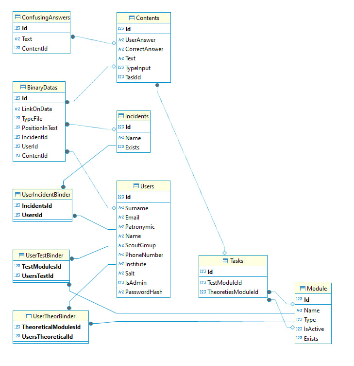

На основе предоставленной схемы базы данных и описания предметной области, давайте разберем каждую таблицу и ее роль в системе обучения волонтеров. Система предназначена для управления обучающими курсами, регистрации на мероприятия, авторизации пользователей и предоставления администраторам возможности добавлять материалы, тесты и мероприятия.



---

### **1. Основные таблицы и их назначение**

#### **Таблица `Users`**
- **Описание**: Хранит информацию о пользователях системы (волонтеры и администраторы).
- **Поля**:
  - `Id`: Уникальный идентификатор пользователя.
  - `Surname`, `Patronymic`, `Name`: Фамилия, отчество и имя пользователя.
  - `Email`: Электронная почта пользователя.
  - `PhoneNumber`: Номер телефона пользователя.
  - `Institute`: Информация об учебном заведении или организации пользователя.
  - `Salt`: Соль для хэширования пароля.
  - `PasswordHash`: Хэшированный пароль пользователя.
  - `IsAdmin`: Флаг, указывающий, является ли пользователь администратором (`true` — администратор, `false` — обычный волонтер).

#### **Таблица `Incidents`**
- **Описание**: Хранит информацию о происшествиях или инцидентах, связанных с волонтерской деятельностью.
- **Поля**:
  - `Id`: Уникальный идентификатор инцидента.
  - `Name`: Название или описание инцидента.
  - `Exists`: Флаг, указывающий, существует ли инцидент (`true` — активен, `false` — удален или архивирован).

#### **Таблица `Tasks`**
- **Описание**: Хранит информацию о задачах или теоретических модулях, которые нужно пройти волонтерам.
- **Поля**:
  - `Id`: Уникальный идентификатор задачи.
  - `TestModuleId`: Связь с теоретическим модулем (`TestModules`), к которому относится задача.
  - `TheoriesModuleId`: Связь с теоретическим модулем (`TheoriesModules`), который содержит эту задачу.

#### **Таблица `Modules`**
- **Описание**: Хранит информацию о модулях обучения (теоретические или практические).
- **Поля**:
  - `Id`: Уникальный идентификатор модуля.
  - `Name`: Название модуля.
  - `Type`: Тип модуля (например, "теоретический", "практический").
  - `IsActive`: Флаг, указывающий, доступен ли модуль для прохождения (`true` — активен, `false` — неактивен).

#### **Таблица `Contents`**
- **Описание**: Хранит контент задач (например, текстовые вопросы или утверждения).
- **Поля**:
  - `Id`: Уникальный идентификатор контента.
  - `UserAnswer`: Ответ пользователя на задачу.
  - `CorrectAnswer`: Правильный ответ на задачу.
  - `Text`: Текстовое описание задачи.
  - `TypelInput`: Тип ввода (например, текстовый, выбор из списка и т. д.).

#### **Таблица `ConfusingAnswers`**
- **Описание**: Хранит возможные неправильные ответы на задачи, чтобы усложнить тестирование.
- **Поля**:
  - `Id`: Уникальный идентификатор неправильного ответа.
  - `Text`: Текст неправильного ответа.
  - `ContentId`: Связь с конкретным контентом (`Contents`), к которому относится этот неправильный ответ.

#### **Таблица `BinaryDatas`**
- **Описание**: Хранит бинарные данные (например, изображения, видео или другие файлы), связанные с контентом.
- **Поля**:
  - `Id`: Уникальный идентификатор бинарных данных.
  - `LinkOnData`: Ссылка на внешний ресурс или путь к файлу.
  - `PositionInText`: Позиция, где эти данные должны быть вставлены в текст задачи.
  - `IncidentId`: Связь с инцидентом (`Incidents`), если данные связаны с инцидентом.
  - `UserId`: Связь с пользователем (`Users`), если данные загружены пользователем.
  - `ContentId`: Связь с контентом (`Contents`), к которому относятся эти данные.

---

### **2. Связующие таблицы (соединительные таблицы)**

#### **Таблица `UserIncidentBinder`**
- **Описание**: Соединяет пользователей (`Users`) с инцидентами (`Incidents`), чтобы отслеживать, какие пользователи участвовали в каждом инциденте.
- **Поля**:
  - `IncidentsId`: Связь с инцидентом (`Incidents`).
  - `UsersId`: Связь с пользователем (`Users`).

#### **Таблица `UserTestBinder`**
- **Описание**: Соединяет пользователей (`Users`) с тестовыми модулями (`TestModules`), чтобы отслеживать прогресс пользователей по тестовым модулям.
- **Поля**:
  - `TestModulesId`: Связь с тестовым модулем (`TestModules`).
  - `UsersTestId`: Связь с пользователем (`Users`).

#### **Таблица `UserTheorBinder`**
- **Описание**: Соединяет пользователей (`Users`) с теоретическими модулями (`TheoreticalModules`), чтобы отслеживать прогресс пользователей по теоретическим модулям.
- **Поля**:
  - `TheoreticalModulesId`: Связь с теоретическим модулем (`TheoreticalModules`).
  - `UsersTheoreticalId`: Связь с пользователем (`Users`).

---

### **3. Объяснение связей между таблицами**

#### **Связь между `Users` и другими таблицами**
- **Авторизация**: В таблице `Users` хранятся данные пользователей, включая пароли и флаг администратора (`IsAdmin`). Администраторы могут добавлять новые материалы, тесты и мероприятия через интерфейс.
- **Прогресс пользователей**: Связующие таблицы (`UserIncidentBinder`, `UserTestBinder`, `UserTheorBinder`) отслеживают, какие пользователи участвуют в инцидентах, проходят тесты и изучают теоретические модули.

#### **Связь между `Incidents`, `Tasks` и `Contents`**
- **Инциденты**: В таблице `Incidents` хранятся события или происшествия, связанные с волонтерской деятельностью. Например, участие волонтера в чрезвычайной ситуации.
- **Задачи и контент**: В таблице `Tasks` хранятся задачи, которые пользователи должны выполнить. Каждая задача связана с конкретным модулем (`Modules`) и имеет свой контент (`Contents`), который может включать текстовые вопросы, изображения и другие материалы.

#### **Связь между `Modules` и `Tasks`**
- **Модули обучения**: В таблице `Modules` хранятся различные модули обучения (теоретические и практические). Каждый модуль может содержать несколько задач (`Tasks`), которые пользователи должны пройти.

#### **Связь между `Contents` и `ConfusingAnswers`**
- **Тестирование**: В таблице `Contents` хранятся вопросы или утверждения для тестирования. Для каждого вопроса в таблице `ConfusingAnswers` хранятся неправильные варианты ответов, чтобы сделать тестирование более сложным.

---

### **4. Роль администратора**
Администраторы (пользователи с флагом `IsAdmin = true` в таблице `Users`) имеют доступ к следующим функциям:
- Добавление новых теоретических материалов (`Modules`).
- Создание новых тестов (`Tasks`).
- Добавление мероприятий (`Incidents`).
- Изменение информации о волонтерах (`Users`).

---

### **5. Итоговая структура данных**
- **Пользователи**: Хранятся в таблице `Users`.
- **Образовательные материалы**: Хранятся в таблицах `Modules`, `Tasks`, `Contents` и `ConfusingAnswers`.
- **Инциденты и мероприятия**: Хранятся в таблице `Incidents`.
- **Прогресс пользователей**: Отслеживается через связующие таблицы (`UserIncidentBinder`, `UserTestBinder`, `UserTheorBinder`).

Эта структура позволяет эффективно управлять данными в системе обучения волонтеров и обеспечивает гибкость при добавлении новых материалов и отслеживании прогресса пользователей.


------
Давайте проанализируем, насколько предложенная структура базы данных соответствует логике предметной области (система обучения волонтеров) и достаточно ли она для реализации требуемых функций.

---

### **Основные требования к системе**
1. **Авторизация**:
   - Регистрация пользователей (волонтеров).
   - Разграничение ролей (администраторы и волонтеры).

2. **Обучающие курсы**:
   - Добавление теоретических материалов.
   - Создание тестов для проверки знаний.

3. **Запись на мероприятия**:
   - Участие в инцидентах или мероприятиях.
   - Отслеживание прогресса пользователей.

4. **Управление администраторами**:
   - Добавление новых материалов, тестов и мероприятий.
   - Изменение базы волонтеров.

---

### **Анализ таблиц**

#### **1. Таблица `Users`**
- **Плюсы**:
  - Хранит всю необходимую информацию о пользователях: ФИО, контактные данные, хэшированный пароль, флаг администратора.
  - Поле `Salt` обеспечивает безопасное хранение паролей.
- **Минусы**:
  - Нет информации о роли пользователя (кроме флага `IsAdmin`). Если система расширится до нескольких ролей (например, "куратор", "эксперт"), это может потребовать доработки.
  - Поле `Institute` может быть избыточным, если информация об учебном заведении не используется активно.

#### **2. Таблица `Incidents`**
- **Плюсы**:
  - Хранит информацию о событиях/мероприятиях.
  - Поле `Exists` позволяет архивировать события без их удаления.
- **Минусы**:
  - Нет полей для деталей события (например, дата, описание, тип события). Это может ограничить функциональность.
  - Связь с пользователями реализована через связующую таблицу (`UserIncidentBinder`), что корректно, но отсутствуют поля для хранения результатов участия (например, статус выполнения).

#### **3. Таблица `Modules`**
- **Плюсы**:
  - Хранит информацию о модулях (теоретических и практических).
  - Поле `Type` позволяет различать типы модулей.
  - Поле `IsActive` позволяет управлять доступностью модулей.
- **Минусы**:
  - Нет поля для описания сложности модуля или его продолжительности, что может быть полезно для планирования обучения.

#### **4. Таблица `Tasks`**
- **Плюсы**:
  - Связывает задачи с модулями (`TestModules`, `TheoriesModules`).
- **Минусы**:
  - Нет явного указания типа задачи (тестовая или теоретическая). Это может привести к путанице при работе с данными.
  - Отсутствуют поля для хранения результатов выполнения задач (например, баллы, время завершения).

#### **5. Таблица `Contents`**
- **Плюсы**:
  - Хранит текстовые вопросы, правильные ответы и варианты ответов.
  - Поле `TypelInput` позволяет задавать тип ввода (например, текстовый, выбор из списка).
- **Минусы**:
  - Нет поля для хранения веса вопроса (например, количество баллов за правильный ответ).
  - Отсутствует связь с конкретными пользователями для хранения их ответов.

#### **6. Таблица `ConfusingAnswers`**
- **Плюсы**:
  - Хранит неправильные ответы для усложнения тестирования.
- **Минусы**:
  - Нет поля для хранения частоты использования неправильных ответов (например, статистика ошибок).

#### **7. Таблица `BinaryDatas`**
- **Плюсы**:
  - Хранит бинарные данные (изображения, видео) и их позицию в тексте.
- **Минусы**:
  - Нет поля для описания типа данных (например, изображение, видео, документ).
  - Поле `LinkOnData` может быть недостаточно гибким, если файлы хранятся локально или в разных облачных хранилищах.

#### **8. Связующие таблицы (`UserIncidentBinder`, `UserTestBinder`, `UserTheorBinder`)**
- **Плюсы**:
  - Реализуют связи между пользователями и событиями, тестами, теоретическими модулями.
- **Минусы**:
  - Нет полей для хранения дополнительной информации о взаимодействии (например, дата участия, результат выполнения).

---

### **Логические минусы структуры**

1. **Отсутствие прогресса пользователей**:
   - В текущей структуре нет таблицы для хранения прогресса пользователей по модулям или мероприятиям. Например, нет полей для хранения результатов тестов (баллы, время завершения).

2. **Недостаточная детализация событий**:
   - Таблица `Incidents` содержит только название и флаг активности. Для полноценного управления мероприятиями нужны дополнительные поля (дата, описание, тип события).

3. **Отсутствие ролей**:
   - Флаг `IsAdmin` в таблице `Users` подходит только для двух ролей (администратор и волонтер). Если система расширится, потребуется таблица для хранения ролей и связей между ролями и пользователями.

4. **Недостаточная гибкость контента**:
   - Таблица `Contents` не хранит вес вопросов (баллы) и не связана с конкретными пользователями для отслеживания их ответов.

5. **Проблемы с медиафайлами**:
   - Таблица `BinaryDatas` не предоставляет достаточной информации о типах файлов и их источниках.

---

### **Рекомендации по улучшению**

1. **Добавьте таблицу для прогресса пользователей**:
   ```sql
   CREATE TABLE UserProgress (
       Id INTEGER PRIMARY KEY,
       UserId INTEGER REFERENCES Users(Id),
       ModuleId INTEGER REFERENCES Modules(Id),
       Score INTEGER,
       CompletedAt DATETIME
   );
   ```

2. **Расширьте таблицу `Incidents`**:
   ```sql
   ALTER TABLE Incidents ADD COLUMN Description TEXT;
   ALTER TABLE Incidents ADD COLUMN EventType TEXT;
   ALTER TABLE Incidents ADD COLUMN EventDate DATETIME;
   ```

3. **Создайте таблицу для ролей**:
   ```sql
   CREATE TABLE Roles (
       Id INTEGER PRIMARY KEY,
       Name TEXT
   );

   CREATE TABLE UserRoleBinder (
       UserId INTEGER REFERENCES Users(Id),
       RoleId INTEGER REFERENCES Roles(Id)
   );
   ```

4. **Добавьте поля для веса вопросов**:
   ```sql
   ALTER TABLE Contents ADD COLUMN Weight INTEGER;
   ```

5. **Расширьте таблицу `BinaryDatas`**:
   ```sql
   ALTER TABLE BinaryDatas ADD COLUMN FileType TEXT;
   ALTER TABLE BinaryDatas ADD COLUMN StorageType TEXT;
   ```

---

### **Итог**
Текущая структура базы данных логически достаточна для базового функционала системы обучения волонтеров. Однако она имеет ряд ограничений:
- Отсутствие прогресса пользователей.
- Недостаточная детализация событий и контента.
- Ограниченная поддержка ролей и медиафайлов.

Если вы планируете расширять функционал системы (например, добавлять новые роли, улучшать управление мероприятиями или анализировать результаты тестов), рекомендуется внедрить предложенные изменения.